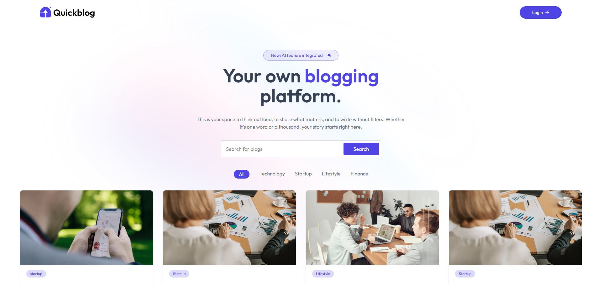
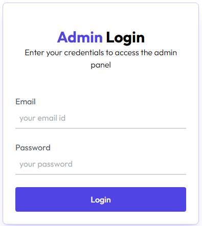
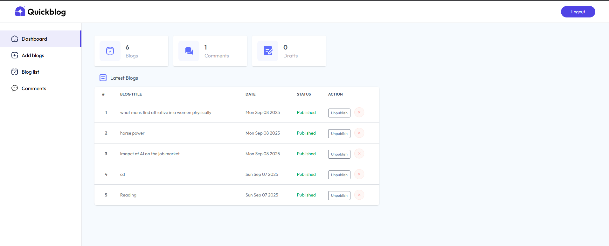

### 📖 QuickBlog

QuickBlog is a **full-stack blogging platform** where an **Admin** can publish, update, and manage blogs, while **Users** can explore blogs, read content, and post comments.  
Built with **MERN stack (MongoDB, Express, React, Node.js)** and includes features like blog publishing, comments, image uploads, and admin moderation.


### ✨ Features

### 👤 User Side
- Browse all published blogs.
- Filter blogs by **categories** and **search** by title.
- View full blog details with images.
- Post comments (requires admin approval).
- Responsive design for mobile & desktop.

### 🔑 Admin Side
- Secure admin login with JWT authentication.
- Add, edit, and delete blogs.
- Upload images via **ImageKit**.
- Publish/Unpublish blogs (draft mode supported).
- Moderate comments (approve/delete).
- View dashboard with stats: total blogs, comments, drafts, and recent blogs.

---

## 🛠️ Tech Stack
- **Frontend**: React, TailwindCSS, React Router, Axios
- **Backend**: Node.js, Express.js
- **Database**: MongoDB (Mongoose ODM)
- **Authentication**: JSON Web Token (JWT)
- **Image Upload**: ImageKit
- **Notifications**: React Hot Toast

---

## 📂 Project Structure

```bash
QUICKBLOG/
│── quickblog/               # React frontend
│   ├── context/             # Global state management
│   ├── public/              # Public static files
│   ├── src/                 # Main source code
│   │   ├── assets/          # Images, icons, and static assets
│   │   ├── components/      # Reusable UI components
│   │   ├── pages/           # Pages (Home, Blog, Admin, Dashboard, etc.)
│   │   └── App.js           # Main React app
│   ├── index.html           # Entry point HTML
│   ├── package.json         # Frontend dependencies & scripts
│   ├── vite.config.js       # Vite configuration
│   └── vercel.json          # Vercel deployment config
│
│── server/                  # Node.js backend
│   ├── configs/             # Config files (DB, ImageKit, etc.)
│   ├── controllers/         # Business logic (blogs, comments, admin)
│   ├── middleware/          # Auth & other middleware
│   ├── models/              # Mongoose models
│   │   ├── Blog.js
│   │   └── Comment.js
│   ├── routes/              # API routes
│   ├── server.js            # Entry point for backend
│   ├── package.json         # Backend dependencies & scripts
│   └── vercel.json          # Vercel deployment config
│
├── README.md                # Project documentation
├── .gitignore               # Git ignored files
└── .env                     # Environment variables

````


### ⚙️ Installation & Setup

### 1️⃣ Clone the repository
```bash
git clone https://github.com/Aman-Negi07/quickblog.git
cd quickblog
````

### 2️⃣ Backend Setup

```bash
cd server
npm install
```

Create a `.env` file in `/server` and add:

```
MONGO_URI=your_mongodb_connection_string
JWT_SECRET=your_jwt_secret
ADMIN_EMAIL=your_admin_email
ADMIN_PASSWORD=your_admin_password
IMAGEKIT_PUBLIC_KEY=your_imagekit_public_key
IMAGEKIT_PRIVATE_KEY=your_imagekit_private_key
IMAGEKIT_URL_ENDPOINT=your_imagekit_url_endpoint
```

Run backend:

```bash
npm run start
```

### 3️⃣ Frontend Setup

```bash
cd client
npm install
npm run dev
```

---

## 🚀 Usage

### 🌍 User

* Visit the homepage to explore blogs.
* Search/filter by category.
* Click on a blog card to view details and post comments.

### 🔑 Admin

* Login with admin credentials (`ADMIN_EMAIL`, `ADMIN_PASSWORD`).
* Access **Dashboard** to view stats.
* Manage blogs: add, delete, publish/unpublish.
* Review and approve/delete comments.

---

## 📸 Screenshots

### 🏠 Homepage



### 📊 Admin Login


### 📊 Admin Dashboard


### 🌐 Live Demo
👉 [QuickBlog](https://quick-blog-two-fawn.vercel.app/)
